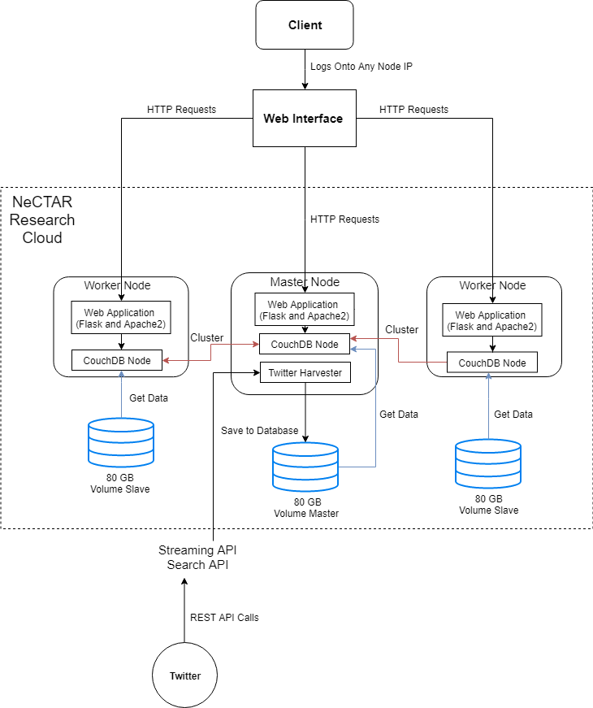

# Sins on Twitter

This is the GitHub repository for Group68's Assignment 2 for the subject Cluster and Cloud Computing (COMP90024). 

## System Architecture
# 

# Team Information
## Group 68  
* Darren Pinto, 1033936  
* Matthew Yong, 765353  
* Mengzhu Long, 943089  
* Wenhao Zhang, 970012  
* Yang Liu, 837689  

## Website Links

### From Project Dashboard
- http://172.26.38.38/app/ 
- http://172.26.37.231/app/
- http://172.26.38.62/app/
### Test Instances
- http://45.113.235.192/app/
- http://45.113.234.144/app/

## Project Directory
```bash
├── deploy                // ansible and deployment configuration
└── src                   // source code root
    ├── tweet_collector   // tweet harverster
    │   └── resources     // resources file used by tweet harverster
    └── web               // flask web application
        ├── resources     // resources file used by tweet web app
        ├── static        // front-end static file
        ├── templates     // front-end pages
        └── utils         // utility module


```

# Deployment Guide 
## Script located at deploy/Ansible

1. Ensure that ansible is installed on your linux machine

2. Adjust/Set the following parameters in the variables folder (do not change anything else):
	- couchdbDetails.yaml
		- Set desired user and password
		- Set desired couchDB version (leave it as couchdb for 'latest')
		- Set desired node count in couchdb cluster
	- instancedetails.yaml
		- Set the local_user field to the user of your local linux machine (for file permission changes)

		- Set the SSH key name to be created in the ansible_key_name variable
		(NOTE make sure that this key does not exist in Nectar, or it will return an empty private key)

		- If user wants to use their own key already existing on Nectar make sure that you
			* Comment out the role "createKeyPair" on nectar.yaml
			* Edit the following line with your corresponding key name on instancedetails.yaml 
			```yaml
			"ansible_key_name": <Your Key Name>
			``` 
			* Add in this line in inventory.ini file after [all:vars]
			```yaml
			ansible_ssh_private_key_file=<Your Key Name>
			``` 
		- Set the desired volumes to be created to volumes list

		- Add the desired security groups you would want to add to each instance on the security_groups list
		(Currently, our script creates security groups that are required in our system, you can more security groups into your instances as long as you define their configuration in roles/createSecurityGroups)

		- Configure the instances you want to create (append to list if you want more)
			* Set your desired server instance_names
			* Set your desired instance_image ID
			* Set your desired instance_flavor

		- Note: Last one on instance_list would be set as the master node 

	- Decrypt the current Ansible-Vault guarded variables/passwords.yaml file by running:

	```bash
	ansible-vault decrypt variables passwords.yaml
	```
	- Type in "group68" to decrypt when asked for vault password

3. Add in your Twitter API Keys, couchDB password and git account password and then lock it by running (note to remember vault password):

```bash
ansible-vault encrypt variables/passwords.yaml
``` 

4. Once all variables/parameters are set, run the following command and enter your sudo and openstack password
 ```bash
 sudo bash run.sh
 ``` 

5. Check that everything is installed (IP addresses can be found in the inventory.ini file):
	* Check Membership Details to confirm cluster setup (all_nodes match cluster_nodes):
	```bash
	curl -XGET "http://<NODE_UP>:5984/_membership"
	```
	* Check that the harvester is running by loging onto fauxton (http://<NODE_IP>:5984/_utils) and check that tweet_database is being populated by refreshing.
	* Checkout web application through (http://<NODE_IP>/app)